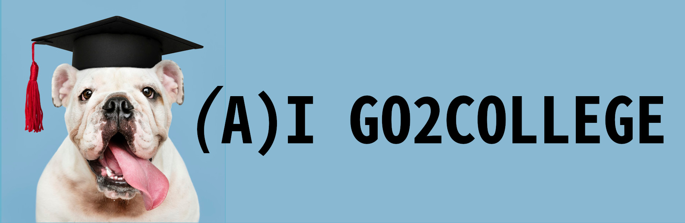
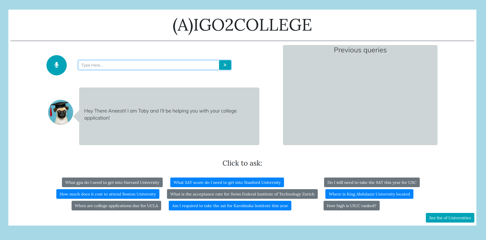

# (A)IGO2COLLEGE

## Inspiration

It's not always easy to find a reliable college guidance counselor. As a result of COVID-19 pandemic, this task has become even more difficult as students shifted to virtual mode of learning and in-person interactions have been restricted to certain extent.
 
### What is (A)IGO2COLLEGE
 
(A)IGO2COLLEGE (as in I-go-to-college) is a web-application designed to help students stay on top of the college application process in the absence of a college guidance counselor. It answers general questions pertaining to academics, tuition and fees, college application requirements, etc. 
 

 
### Try it here <https://aigo2college.netlify.app/>
 
We took a rather unconventional approach for the UI that's easy to navigate even for an internet novice. We tried to follow Facebook's principles of inclusivity to ensure no one is left out.
 
 
## Tasks
 
Application was trained on `550+ statements` based on the 2019 global ranking of universities. Goal was to train these statements well enough to respond to users with accurate information pertaining to their dream universities.
 
## What you can ask
 
Ask stuff like:
 
- What gpa do I need to get into Harvard University?
 
- What SAT score do I need to get into Stanford University?
 
- Am I still required to take the SAT for UPENN?
 
- How high is National University of Singapore ranked?
 
- What is the acceptance rate for Catholic University of Leuven 
.... and many more questions from our ever learning College assistant.
 
## Dataset Collection
 
Dataset is collected from a variety of sources with the most up-to-date information. Our database is based on global ranking. The cutoff for the database was around rank 80.
 
References include:
 
- <https://www.collegesimply.com/>
 
- <https://www.usnews.com/education/best-global-universities/rankings?int=a27a09>
 
## Technology
 
(A)IGO2College uses the wit.ai to better understand users' query and provide them with reliable results.
 
We also use Fuzzy string matching as a safety net in case users get a University spellings wrong to provide an even better user experience.
 
## What's Next for us
 
### Some of our near-future plans
 
- Scale it for our mobile users.
 
- Expanding our database with more universities, including liberal arts colleges and community colleges and adding info like what all majors are provided by the universities.
 
- Making the app more personalised by providing an interactive dashboard for each user and giving analysed results for what university they should apply to given their scores and achievements.

- Choice to link accounts with third party apps like google calendar or facebook to set reminders for important dates.

### Some of the not-so-near future plans

- Much of the college data wasn't that easily scrapable and not even search-able when we collected our data. Many universities don't keep their sites updated either. So we wish to kick-start this crowdsourced wikipedia-like information database so that people are more informed while applying to colleges.
